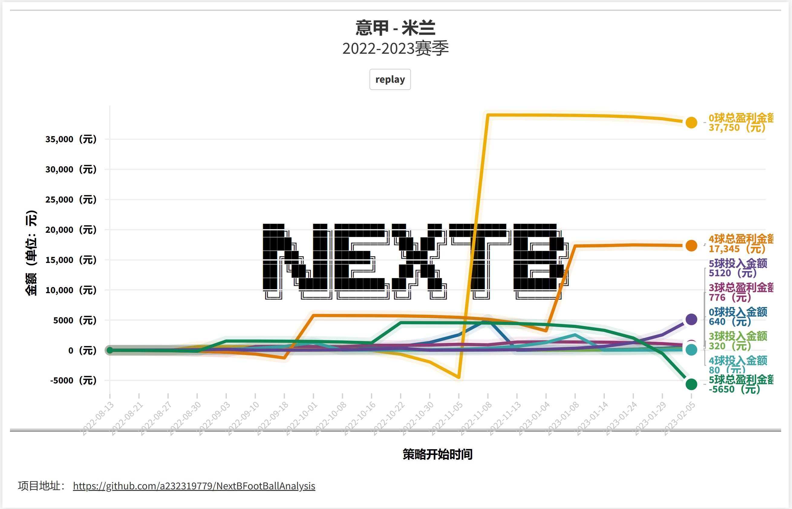
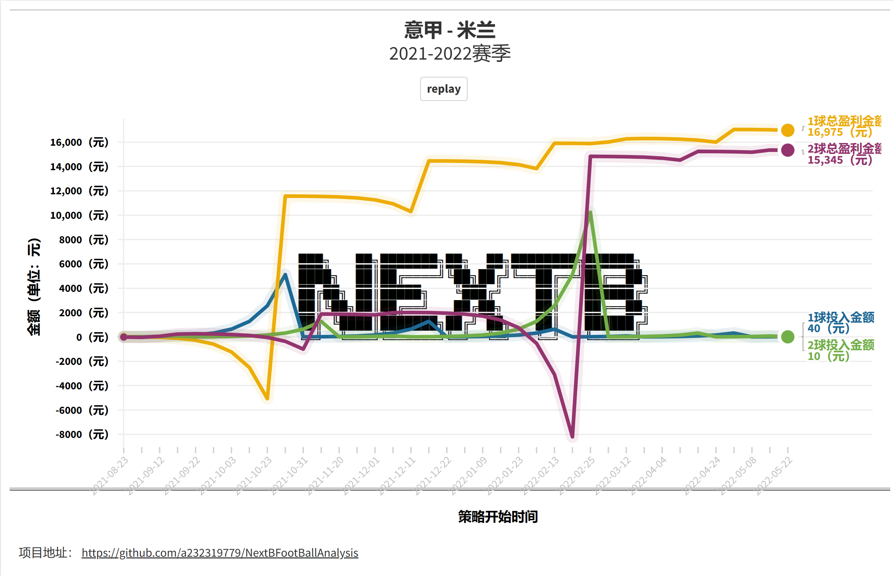
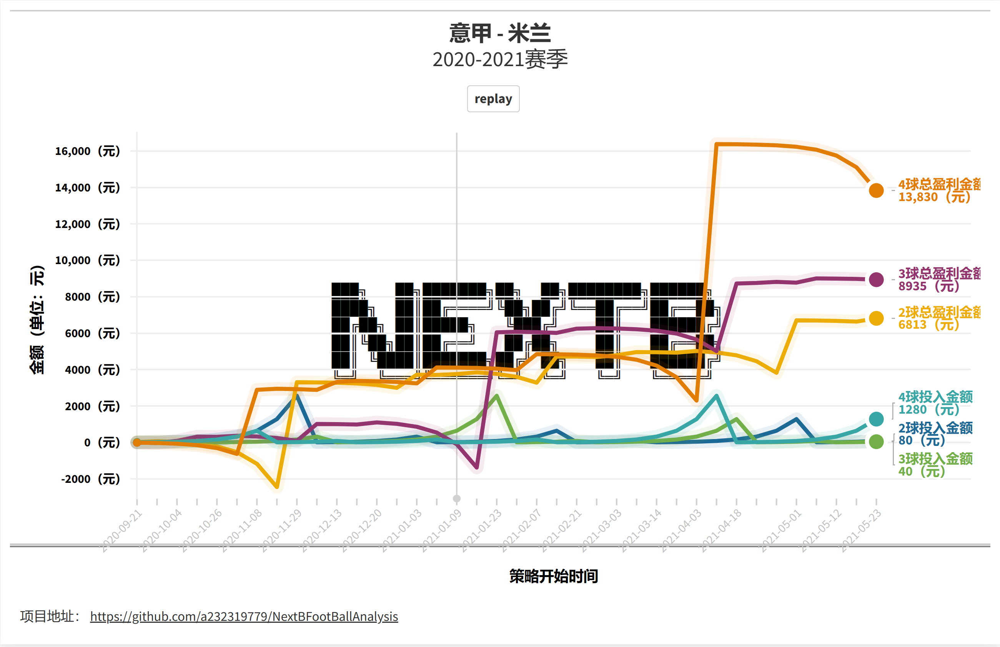

# NextB 足球数据分析

## 安装

安装命令：`pip install NextBFootBallAnalysis`

**pip 包中仅包含英超数据库文件，数据更新至 2023-03-19**

## 一、数据

| 联赛 | 数据更新时间 | 备注                                  |
| ---- | ------------ | ------------------------------------- |
| 英超 | 2023-03-19   | pip 包自带                            |
| 意甲 | 2023-03-19   | 通过[微信公众号获取](#四公众号二维码) |
| 西甲 | 2023-03-19   | 通过[微信公众号获取](#四公众号二维码) |
| 德甲 | 2022-03-19   | 通过[微信公众号获取](#四公众号二维码) |
| 法甲 | 2023-03-19   | 通过[微信公众号获取](#四公众号二维码) |

**关注公众号：[NextB](#四公众号二维码)，发送私信：“足球数据”获取下载链接。**

## 二、命令行

| 功能点                         | 说明                                                                                               | 使用示例                             |
| ------------------------------ | -------------------------------------------------------------------------------------------------- | ------------------------------------ |
| nextb-football-init-db         | NextB 初始化 football 数据库                                                                       | `nextb-football-init-db -d $csv_dir` |
| nextb-football-get-last-matchs | NextB 获取联赛最后一场比赛数据，报告格式参考[联赛信息格式](#31-联赛信息格式)                       | `nextb-football-get-last-matchs`     |
| nextb-football-get-team        | NextB 获取指定球队最近 N 场比赛结果，结果格式参考[球队比赛结果](#32-球队比赛结果)                  | `nextb-football-get-team -n 5`       |
| nextb-football-get-recommend   | NextB 推荐 5 大联赛进球数对应的球队，结果格式参考[球队推荐结果](#33-球队推荐结果)队                | `nextb-football-get-recommend`       |
| nextb-football-get-match       | NextB 获取指定球队指定赛季的进球数统计结果，结果格式参考[球队比赛结果](#34-球队比赛进球数统计结果) | `nextb-football-get-match`           |
| nextb-football-simulation      | NextB 基于足球数据的彩票投注仿真程序，结果参考[投注仿真](#六投注仿真)                              | `nextb-football-simulation`          |
| nextb-football-get-markdown    | NextB 获取指定两支球队的分析报告                                                                   | `nextb-football-get-markdown`        |

## 三、结果输出

### 3.1 联赛信息格式

```
> nextb-football-get-last-matchs.exe

+----------+-----------+------------------+----------+----------+----------+----------+
| 联赛名称 |    赛季   |     比赛时间     |   主队   |   客队   | 半场比分 | 全场比分 |
+----------+-----------+------------------+----------+----------+----------+----------+
|   英超   | 2022-2023 | 2023/01/05 20:00 |  切尔西  |   曼城   |   0-0    |   0-1    |
|   意甲   | 2022-2023 | 2023/01/08 19:45 |   米兰   |   罗马   |   1-0    |   2-2    |
|   西甲   | 2022-2023 | 2023/01/09 20:00 | 毕尔巴鄂 | 奥萨苏纳 |   0-0    |   0-0    |
|   德甲   | 2022-2023 | 2022/11/13 16:30 |  弗莱堡  | 柏林联合 |   4-0    |   4-1    |
|   法甲   | 2022-2023 | 2023/01/11 20:00 |  特鲁瓦  |   马赛   |   0-1    |   0-2    |
+----------+-----------+------------------+----------+----------+----------+----------+
```

### 3.2 球队比赛结果

```
> nextb-football-get-team-match.exe -n 5
+---------------+--------+----------+----------+----------+
|    比赛时间   |  主队  |   客队   | 半场比分 | 全场比分 |
+---------------+--------+----------+----------+----------+
| 2023/01/03 19 | 阿森纳 | 纽卡斯尔 |   0-0    |   0-0    |
| 2022/12/31 17 | 布莱顿 |  阿森纳  |   0-2    |   2-4    |
| 2022/12/26 20 | 阿森纳 |  西汉姆  |   0-1    |   3-1    |
| 2022/11/12 19 |  狼队  |  阿森纳  |   0-0    |   0-2    |
| 2022/11/06 12 | 切尔西 |  阿森纳  |   0-0    |   0-1    |
+---------------+--------+----------+----------+----------+
```

### 3.3 球队推荐结果

```
> nextb-football-get-recommend.exe -g 2
+----------+--------------+-------------+----------+-------------+-----------+----------+
| 联赛名称 |   球队名称   | 联赛2球占比 | 比赛场次 | 球队2球占比 | 2022-2023 | 占比方差 |
+----------+--------------+-------------+----------+-------------+-----------+----------+
|   英超   |    切尔西    |    0.241    |   1134   |    0.244    |    0.25   |  0.0023  |
|   英超   |    埃弗顿    |    0.241    |   1134   |    0.261    |   0.375   |  0.0053  |
|   英超   |     维拉     |    0.241    |   1020   |    0.246    |   0.292   |  0.0067  |
|   意甲   |   尤文图斯   |    0.249    |   1043   |    0.269    |   0.304   |  0.0042  |
|   意甲   |    拉齐奥    |    0.249    |   1081   |    0.252    |   0.348   |  0.0057  |
|   意甲   |   那不勒斯   |    0.249    |   798    |    0.252    |    0.25   |  0.0096  |
|   西甲   | 比利亚雷亚尔 |    0.242    |   858    |    0.251    |   0.227   |  0.0081  |
|   西甲   |    塞尔塔    |    0.242    |   905    |    0.262    |   0.174   |  0.0082  |
|   西甲   |  巴拉多利德  |    0.242    |   753    |    0.256    |    0.13   |  0.0096  |
|   德甲   |   斯图加特   |     0.24    |   940    |    0.243    |   0.227   |  0.0044  |
|   德甲   |   沙尔克04   |     0.24    |   974    |    0.264    |   0.136   |  0.0074  |
|   德甲   |     波鸿     |     0.24    |   464    |     0.25    |   0.182   |  0.0105  |
|   法甲   |     里尔     |    0.263    |   995    |     0.27    |    0.2    |  0.0062  |
|   法甲   |     雷恩     |    0.263    |   1059   |    0.271    |    0.2    |  0.0066  |
|   法甲   |     南特     |    0.263    |   907    |    0.275    |    0.24   |  0.0077  |
+----------+--------------+-------------+----------+-------------+-----------+----------+
```

## 3.4 球队比赛进球数统计结果

```
> nextb-football-get-match.exe
+--------+--------+-----------+---------+------------------+----------------+
| 进球数 | 总场次 | 主:切尔西 | 主:曼联 |     最近一场     |    比赛结果    |
+--------+--------+-----------+---------+------------------+----------------+
|   2    |   16   |     7     |    9    | 2022/10/22 17:30 |      平局      |
|   3    |   11   |     4     |    7    | 2018/02/25 00:00 |  曼联（主胜）  |
|   1    |   10   |     7     |    3    | 2017/11/05 00:00 | 切尔西（主胜） |
|   4    |   8    |     4     |    4    | 2019/08/11 16:30 |  曼联（主胜）  |
|   0    |   7    |     3     |    4    | 2021/02/28 16:30 |      平局      |
|   5    |   5    |     4     |    1    | 2012/10/28 00:00 |  曼联（客胜）  |
|   6    |   2    |     1     |    1    | 2012/02/05 00:00 |      平局      |
+--------+--------+-----------+---------+------------------+----------------+
```

## 四、公众号二维码

微信扫描二维码，关注公众号


## 五、据库存储格式

| 字段名称  | 字段类型 | 字段说明                                    |
| --------- | -------- | ------------------------------------------- |
| id        | int      | 记录 ID, 主键, 自增                         |
| div       | str      | 联赛名称, E0: 英超                          |
| season    | str      | 赛季, 如: 2022-2023                         |
| date_time | datetime | 比赛时间                                    |
| home_team | str      | 主队名称                                    |
| away_team | str      | 客队名称                                    |
| fthg      | int      | 全场主队进球                                |
| ftag      | int      | 全场客队进球                                |
| ftg       | int      | 全场进球数                                  |
| ftr       | str      | 全场比赛结果, H: 主队胜, A: 客队胜, D: 平局 |
| hthg      | int      | 半场主队进球, 缺省值为-1                    |
| htag      | int      | 半场客队进球, 缺省值为-1                    |
| htg       | int      | 半场进球数, 缺省值为-1                      |
| htr       | str      | 半场比赛结果, H: 主队胜, A: 客队胜, D: 平局 |

## 六、投注仿真

### 6.1 进球倍投策略仿真收益

通过倍投法投注体育彩票进球数，结合历史数据进行仿真回测，评估收益情况。按赛季仿真抽样结果如下：

| 赛季      | 进球数 | 单次最大投入 | 最大收益 |
| --------- | ------ | ------------ | -------- |
| 2022-2023 | 0      | 5120         | 39020    |
| 2022-2023 | 3      | 1280         | 1396     |
| 2022-2023 | 4      | 2560         | 17465    |
| 2021-2022 | 1      | 5120         | 17045    |
| 2021-2022 | 2      | 10240        | 15345    |
| 2020-2021 | 2      | 2560         | 6812     |
| 2020-2021 | 3      | 2560         | 9005     |
| 2020-2021 | 4      | 2560         | 16380    |

#### 6.1.1 米兰 2022-2023 赛季仿真结果



[动态图链接](https://public.flourish.studio/visualisation/12772883/)

#### 6.1.2 米兰 2021-2022 赛季仿真结果



[动态图链接](https://public.flourish.studio/visualisation/12772833/)

#### 6.1.3 米兰 2020-2021 赛季仿真结果



[动态图链接](https://public.flourish.studio/visualisation/12772865/)
