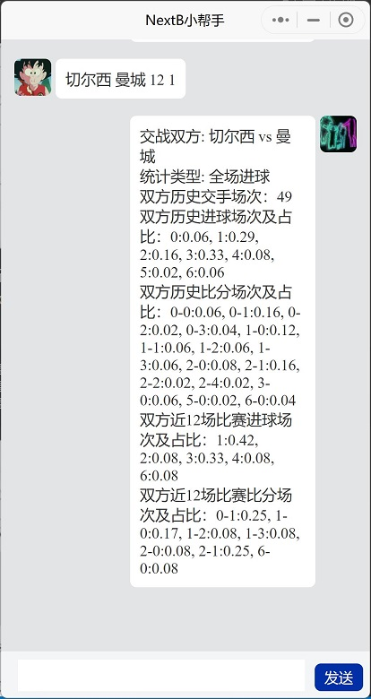
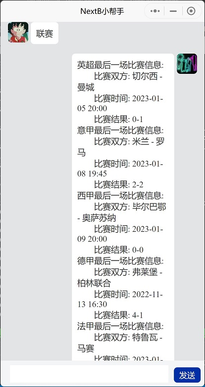
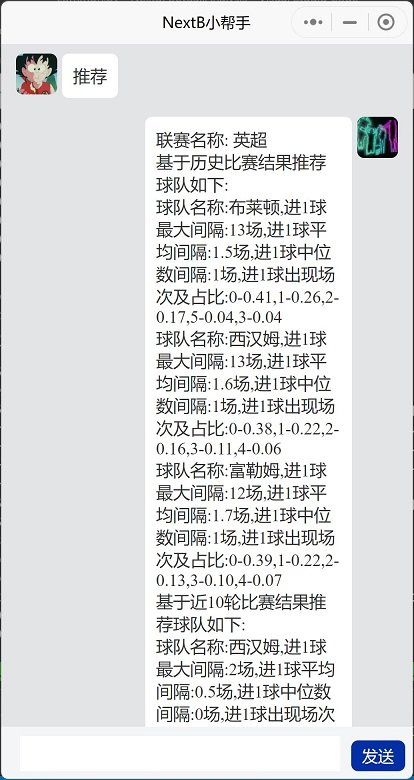

# NextB足球数据分析

**注意：github源码中不包含数据库文件，`pip`包中包含英超数据库文件**

`pip`安装命令：`pip install NextBFootBallAnalysis`

## 推荐

|联赛|赛季|球队|类型|数量|
|----|----|----|----|----|
|英超|2022-2023|南安普顿|半场进球|1|
|意甲|2022-2023|桑普|半场进球|1|
|西甲|2022-2023|巴列卡诺|半场进球|1|
|德甲|2022-2023|科隆|半场进球|1|
|法甲|2022-2023|斯特拉斯堡|半场进球|1|

## 一、数据

|联赛|数据录入|开始赛季|数据更新时间|备注|
|----|----|----|----|----|
|英超|✔|1993-1994|2023-01-05|pip包自带|
|意甲|✔|1993-1994|2023-01-08|需单独获取|
|西甲|✔|1993-1994|2023-01-09|需单独获取|
|德甲|✔|1993-1994|2022-11-13|需单独获取|
|法甲|✔|1993-1994|2023-01-11|需单独获取|

**数据库太大，发行包无法上传，关注公众号：[NextB](#七公众号二维码)，发送私信获取。或者直接使用小程序: [NextB小帮手](#六小程序二维码)，获取报告结果。**

## 二、命令行

|功能点|说明|使用示例|
|----|----|----|
|nextb-football-init-db|NextB初始化football数据库|`nextb-football-init-db -d $csv_dir`|
|nextb-football-update-db|NextB更新football数据库|`nextb-football-update-db -f $csv_file -n $update_number`|
|nextb-football-team-report|NextB获取指定球队的分析报告，报告格式参考[球队分析报告](#31-球队分析报告格式如下)|`nextb-football-team-report -n 热刺`|
|nextb-football-match-report|NextB获取指定两支球队的比赛分析报告，报告格式参考[比赛分析报告](#32-比赛分析报告格式)|`nextb-football-match-report -h 切尔西 -a 曼城`|
|nextb-football-get-statics-report|NextB获取联赛最后一场比赛数据，报告格式参考[联赛信息格式](#33-联赛信息格式)|`nextb-football-get-statics-report`|
|nextb-football-get-recommend-report|NextB获取推荐球队分析报告，报告格式参考[推荐球队报告格式](#34-推荐球队报告格式)|`nextb-football-get-recommend-report`|
|nextb-football-get-team-match|NextB获取指定球队最近N场比赛结果，结果格式参考[球队比赛结果](#35-球队比赛结果)|`nextb-football-get-team-match -n 5`|
|||||

## 三、分析结果

**注意：统计结果中的`-1`表示数据缺失，没有统计到该数据。如：英超1993-1995两个赛季，没有记录半场比分，则半场比分统一记为-1**

### 3.1 球队分析报告格式

```
> nextb-football-get-team-report.exe -t 切尔西
球队名称：切尔西

统计类型: 半场进球
历史比赛场次：1126
历史进球场次及占比：-1:0.14, 0:0.14, 1:0.14, 2:0.14, 3:0.14, 4:0.14, 5:0.14
主场进球场次及占比：-1:0.07, 0:0.27, 1:0.29, 2:0.24, 3:0.11, 4:0.03, 5:0.00
客场进球场次及占比：-1:0.07, 0:0.27, 1:0.37, 2:0.17, 3:0.08, 4:0.03, 5:0.00
近10场比赛进球场次及占比：0:0.25, 1:0.25, 2:0.25, 3:0.25
近4场比赛主场进球场次及占比：0:0.50, 1:0.25, 2:0.25
近6场比赛客场进球场次及占比：0:0.33, 1:0.33, 2:0.17, 3:0.17
近5个赛季场次: 5
近5个赛季进球场次及占比：0:0.20, 1:0.20, 2:0.20, 3:0.20, 4:0.20
近5个赛季主场进球场次及占比：0:0.37, 1:0.33, 2:0.18, 3:0.07, 4:0.05
近5个赛季客场进球场次及占比：0:0.28, 1:0.32, 2:0.24, 3:0.11, 4:0.06
```

### 3.2 比赛分析报告格式

```
> nextb-football-get-match-report.exe -ht 切尔西 -at 曼城

交战双方: 切尔西 vs 曼城
统计类型: 半场进球
双方历史交手场次：48
双方历史进球场次及占比：-1:0.08, 0:0.31, 1:0.27, 2:0.25, 3:0.06, 4:0.02
双方历史比分场次及占比：-1--1:0.08, 0-0:0.31, 0-1:0.08, 0-3:0.02, 1-0:0.19, 1-1:0.15, 2-0:0.10, 2-1:0.04, 4-0:0.02
双方近10场比赛进球场次及占比：0:0.40, 1:0.30, 3:0.20, 4:0.10
双方近10场比赛比分场次及占比：0-0:0.40, 0-3:0.10, 1-0:0.30, 2-1:0.10, 4-0:0.10
"""
```

### 3.3 联赛信息格式

```
> nextb-football-get-statics-report.exe

+----------+-----------+------------------+----------+----------+----------+----------+
| 联赛名称 |    赛季   |     比赛时间     |   主队   |   客队   | 半场比分 | 全场比分 |
+----------+-----------+------------------+----------+----------+----------+----------+
|   英超   | 2022-2023 | 2023/01/05 20:00 |  切尔西  |   曼城   |   0-0    |   0-1    |
|   意甲   | 2022-2023 | 2023/01/08 19:45 |   米兰   |   罗马   |   1-0    |   2-2    |
|   西甲   | 2022-2023 | 2023/01/09 20:00 | 毕尔巴鄂 | 奥萨苏纳 |   0-0    |   0-0    |
|   德甲   | 2022-2023 | 2022/11/13 16:30 |  弗莱堡  | 柏林联合 |   4-0    |   4-1    |
|   法甲   | 2022-2023 | 2023/01/11 20:00 |  特鲁瓦  |   马赛   |   0-1    |   0-2    |
+----------+-----------+------------------+----------+----------+----------+----------+
```

### 3.4 推荐球队报告格式

```
> nextb-football-get-recommend-report.exe   
联赛名称: 英超
基于历史比赛结果推荐球队如下:
球队名称:布莱顿,进1球最大间隔:13场,进1球平均间隔:1.5场,进1球中位数间隔:1场,进1球出现场次及占比:0-0.41,1-0.26,2-0.17,5-0.04,3-0.04
球队名称:西汉姆,进1球最大间隔:13场,进1球平均间隔:1.6场,进1球中位数间隔:1场,进1球出现场次及占比:0-0.38,1-0.22,2-0.16,3-0.11,4-0.06
球队名称:富勒姆,进1球最大间隔:12场,进1球平均间隔:1.7场,进1球中位数间隔:1场,进1球出现场次及占比:0-0.39,1-0.22,2-0.13,3-0.10,4-0.07
基于近10轮比赛结果推荐球队如下:
球队名称:西汉姆,进1球最大间隔:2场,进1球平均间隔:0.5场,进1球中位数间隔:0场,进1球出现场次及占比:0-0.64,1-0.27,2-0.09     
球队名称:南安普敦,进1球最大间隔:2场,进1球平均间隔:0.5场,进1球中位数间隔:0.0场,进1球出现场次及占比:0-0.75,2-0.25        
球队名称:富勒姆,进1球最大间隔:4场,进1球平均间隔:1.4场,进1球中位数间隔:0场,进1球出现场次及占比:0-0.57,3-0.29,4-0.14     

联赛名称: 意甲
基于历史比赛结果推荐球队如下:
球队名称:蒙扎,进0球最大间隔:4场,进0球平均间隔:1.2场,进0球中位数间隔:0.5场,进0球出现场次及占比:0-0.50,1-0.25,4-0.25     
球队名称:克雷莫纳,进0球最大间隔:6场,进0球平均间隔:1.4场,进0球中位数间隔:1.0场,进0球出现场次及占比:0-0.45,1-0.25,4-0.15,3-0.05,6-0.05
球队名称:都灵,进1球最大间隔:9场,进1球平均间隔:1.6场,进1球中位数间隔:1场,进1球出现场次及占比:0-0.40,1-0.24,2-0.11,3-0.09,4-0.05
基于近10轮比赛结果推荐球队如下:
球队名称:克雷莫纳,进0球最大间隔:4场,进0球平均间隔:1.0场,进0球中位数间隔:0场,进0球出现场次及占比:0-0.57,2-0.14,4-0.14,1-0.14
球队名称:恩波利,进0球最大间隔:4场,进0球平均间隔:1.1场,进0球中位数间隔:0场,进0球出现场次及占比:0-0.57,1-0.14,4-0.14,3-0.14
球队名称:拉齐奥,进1球最大间隔:6场,进1球平均间隔:1.1场,进1球中位数间隔:0场,进1球出现场次及占比:0-0.56,1-0.22,2-0.11,6-0.11

联赛名称: 西甲
基于历史比赛结果推荐球队如下:
球队名称:加的斯,进1球最大间隔:11场,进1球平均间隔:1.4场,进1球中位数间隔:0.5场,进1球出现场次及占比:0-0.50,1-0.19,3-0.11,2-0.09,4-0.06
球队名称:埃尔切,进1球最大间隔:10场,进1球平均间隔:1.4场,进1球中位数间隔:1场,进1球出现场次及占比:0-0.38,1-0.26,2-0.17,3-0.10,4-0.06
球队名称:巴列卡诺,进1球最大间隔:9场,进1球平均间隔:1.5场,进1球中位数间隔:1场,进1球出现场次及占比:0-0.37,1-0.26,2-0.13,3-0.12,4-0.04
基于近10轮比赛结果推荐球队如下:
球队名称:塞尔塔,进1球最大间隔:3场,进1球平均间隔:0.7场,进1球中位数间隔:0.0场,进1球出现场次及占比:0-0.70,2-0.20,3-0.10   
球队名称:奥萨苏纳,进1球最大间隔:4场,进1球平均间隔:0.8场,进1球中位数间隔:0.0场,进1球出现场次及占比:0-0.60,1-0.20,2-0.10,4-0.10
球队名称:巴塞罗那,进1球最大间隔:6场,进1球平均间隔:2.2场,进1球中位数间隔:0场,进1球出现场次及占比:0-0.60,6-0.20,5-0.20   

联赛名称: 德甲
基于历史比赛结果推荐球队如下:
球队名称:多特蒙德,进1球最大间隔:10场,进1球平均间隔:1.6场,进1球中位数间隔:1场,进1球出现场次及占比:0-0.36,1-0.23,2-0.16,3-0.09,4-0.07
球队名称:RB莱比锡,进1球最大间隔:10场,进1球平均间隔:1.7场,进1球中位数间隔:1.0场,进1球出现场次及占比:0-0.34,1-0.25,3-0.14,2-0.12,4-0.07
球队名称:沙尔克04,进1球最大间隔:12场,进1球平均间隔:1.7场,进1球中位数间隔:1场,进1球出现场次及占比:0-0.38,1-0.24,2-0.15,3-0.06,4-0.05
基于近10轮比赛结果推荐球队如下:
球队名称:门兴格莱德巴赫,进0球最大间隔:0场,进0球平均间隔:0.0场,进0球中位数间隔:0场,进0球出现场次及占比:0-1.00
球队名称:美因兹,进1球最大间隔:2场,进1球平均间隔:0.6场,进1球中位数间隔:0场,进1球出现场次及占比:0-0.60,1-0.20,2-0.20     
球队名称:多特蒙德,进1球最大间隔:4场,进1球平均间隔:0.7场,进1球中位数间隔:0场,进1球出现场次及占比:0-0.78,2-0.11,4-0.11   

联赛名称: 法甲
基于历史比赛结果推荐球队如下:
球队名称:克莱蒙,进1球最大间隔:6场,进1球平均间隔:1.2场,进1球中位数间隔:1场,进1球出现场次及占比:0-0.43,1-0.24,2-0.24,6-0.05,5-0.05
球队名称:布雷斯特,进1球最大间隔:6场,进1球平均间隔:1.4场,进1球中位数间隔:1.0场,进1球出现场次及占比:0-0.43,1-0.24,2-0.12,5-0.07,4-0.06
球队名称:兰斯,进1球最大间隔:7场,进1球平均间隔:1.4场,进1球中位数间隔:1.0场,进1球出现场次及占比:0-0.40,1-0.27,2-0.11,3-0.10,4-0.05
基于近10轮比赛结果推荐球队如下:
球队名称:巴黎圣日耳曼,进1球最大间隔:1场,进1球平均间隔:0.3场,进1球中位数间隔:0场,进1球出现场次及占比:0-0.73,1-0.27      
球队名称:雷恩,进0球最大间隔:1场,进0球平均间隔:0.3场,进0球中位数间隔:0场,进0球出现场次及占比:0-0.67,1-0.33
球队名称:斯特拉斯堡,进1球最大间隔:2场,进1球平均间隔:0.4场,进1球中位数间隔:0.0场,进1球出现场次及占比:0-0.75,2-0.17,1-0.08
```

### 3.5 球队比赛结果

```
> nextb-football-get-team-match.exe -n 5
+---------------+--------+----------+----------+----------+
|    比赛时间   |  主队  |   客队   | 半场比分 | 全场比分 |
+---------------+--------+----------+----------+----------+
| 2023/01/03 19 | 阿森纳 | 纽卡斯尔 |   0-0    |   0-0    |
| 2022/12/31 17 | 布莱顿 |  阿森纳  |   0-2    |   2-4    |
| 2022/12/26 20 | 阿森纳 |  西汉姆  |   0-1    |   3-1    |
| 2022/11/12 19 |  狼队  |  阿森纳  |   0-0    |   0-2    |
| 2022/11/06 12 | 切尔西 |  阿森纳  |   0-0    |   0-1    |
+---------------+--------+----------+----------+----------+
```

## 四、据库存储格式

|字段名称|字段类型|字段说明|
|----|----|----|
|id|int|记录ID, 主键, 自增|
|div|str|联赛名称, E0: 英超|
|season|str|赛季, 如: 2022-2023|
|date_time|datetime|比赛时间|
|home_team|str|主队名称|
|away_team|str|客队名称|
|fthg|int|全场主队进球|
|ftag|int|全场客队进球|
|ftg|int|全场进球数|
|ftr|str|全场比赛结果, H: 主队胜, A: 客队胜, D: 平局|
|hthg|int|半场主队进球, 缺省值为-1|
|htag|int|半场客队进球, 缺省值为-1|
|htg|int|半场进球数, 缺省值为-1|
|htr|str|半场比赛结果, H: 主队胜, A: 客队胜, D: 平局|

## 五、微信小程序

### 5.1 发送球队名称，获取球队分析结果

发送命令格式，用`空格`分隔：`球队名称 [可选,默认最近10场]最近比赛场次 [可选,默认最近5个赛季]最近赛季数量 [可选,默认统计半场进球]0`

示例命令如下：

```
切尔西            # 统计切尔西最近10场比赛、最近5个赛季比赛的半场进球数
切尔西 15         # 统计切尔西最近15场比赛、最近5个赛季比赛的半场进球数
切尔西 15 3       # 统计切尔西最近15场比赛、最近3个赛季比赛的半场进球数
切尔西 12 4 1     # 统计切尔西最近12场比赛、最近4个赛季比赛的全场进球数
```


### 5.2 发送比赛双方球队名称，获取比赛分析结果

发送命令格式，用`空格`分隔：`主队名称 客队名称 [可选,默认最近10场]最近比赛场次 [可选,默认统计半场进球]0`

示例命令如下：

```
切尔西 曼城             # 统计切尔西和曼城最近10场比赛的半场进球数
切尔西 曼城 15          # 统计切尔西和曼城最近15场比赛的半场进球数
切尔西 曼城 12 1        # 统计切尔西和曼城最近12场比赛的全场进球数
```



### 5.3 发送“联赛”关键字及联赛名称，获取联赛信息

发送命令格式，用`空格`分隔：`联赛 [可选,默认5大联赛]英超`

示例命令如下：

```
联赛            # 获取最新的5大联赛比赛情况
联赛 英超       # 获取英超比赛情况
```



### 5.4 发送“推荐”关键字，获取推荐球队

发送命令格式，用`空格`分隔：`推荐 [可选,默认统计半场进球]0`

示例命令如下：

```
推荐             # 获取5大联赛半场进球推荐球队
推荐 1           # 获取5大联赛全场进球推荐球队
```


## 六、小程序二维码

微信扫描二维码，体验小程序


## 七、公众号二维码

微信扫描二维码，关注公众号


